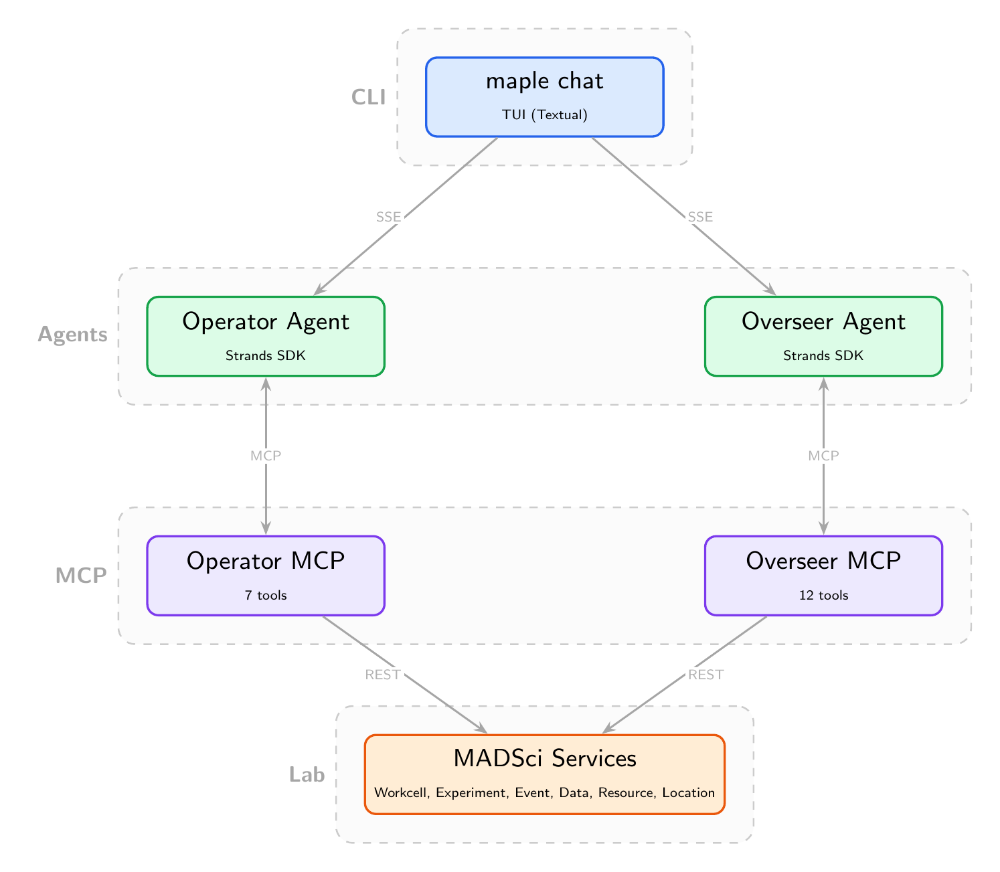

# MAPLE

**Model-Agnostic Platform for Laboratory Experiments**

MAPLE adds LLM agent capabilities to any [MADSci](https://github.com/AD-SDL/MADSci)-powered laboratory via MCP. Two agents — an **Operator** for experiment execution and an **Overseer** for lab monitoring — connect to your lab through configurable MCP servers.

## Architecture



## Quick Start

```bash
pip install maple-mcp
cd your-experiment/
maple serve stub        # Start demo (no LLM needed)
maple chat operator     # Open TUI — type anything
maple down              # Stop all services
```

See [`examples/block_sorting/`](examples/block_sorting/) for a complete walkthrough.

## Installation

```bash
pip install maple-mcp
```

Requires Python 3.10+ and a running [MADSci](https://github.com/AD-SDL/MADSci) lab (v0.5.x).

## CLI

```
maple serve {all, operator, overseer, stub, mock} [--dev]
maple chat {operator, overseer} [--resume]
maple down
maple status
maple logs
```

## Configuration

One `maple.config.yaml` per experiment:

```yaml
experiment:
  name: My Experiment
  objective: Sort samples by type
  constraints:
    - "Only handle one sample at a time"

operator:
  vision_backend: "vision:MyVision"
  custom_tools:
    - "my_tools:prepare_sample"
  post_action_hooks:
    - node: AnalysisNode
      action: verify_placement
```

Infrastructure goes in `.env` (IPs, API keys, model provider).

## Extending MAPLE

| Extension Point | Mechanism | Config Key |
|---|---|---|
| Vision detection | Subclass `VisionBackend` | `operator.vision_backend` |
| MCP tools | `@mcp.tool` decorator | `operator.custom_tools` / `overseer.custom_tools` |
| Agent hooks | `extra_hooks` param on factory | Programmatic |
| Post-action hooks | YAML (no code) | `operator.post_action_hooks` |
| System prompts | Markdown file | `operator.prompt` / `overseer.prompt` |

## Supported Models

| Provider | Environment Variable |
|---|---|
| OpenAI | `MODEL_PROVIDER=openai` |
| Anthropic | `MODEL_PROVIDER=anthropic` |
| Ollama (local, free) | `MODEL_PROVIDER=ollama` |

## Multi-User

Each device auto-generates a unique identity token. Multiple users can run experiments simultaneously — sessions are isolated automatically.

## Programmatic Usage

```python
from maple.operator.agent import create_operator_agent

agent = create_operator_agent("my-session")
result = agent("Sort the colored blocks by color.")
```

## Testing

```bash
pytest -m "not integration"                    # Unit tests (no network)
docker compose -f docker-compose.ci.yaml up -d # Start MADSci
pytest -m integration                          # Integration tests
```

## Compatibility

- Python 3.10+
- MADSci >=0.5.0, <0.6.0
- FastMCP 3.x

## License

[MIT](LICENSE)
